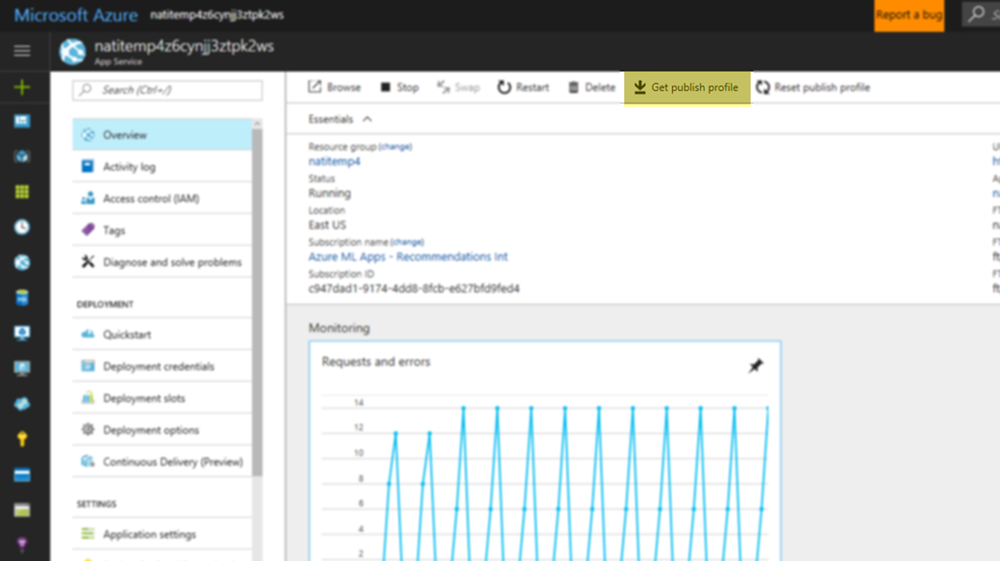
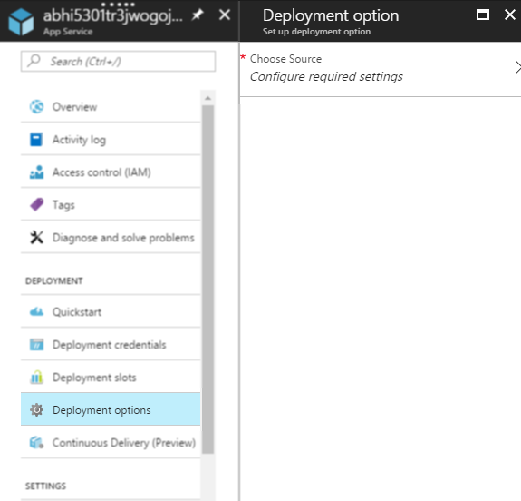
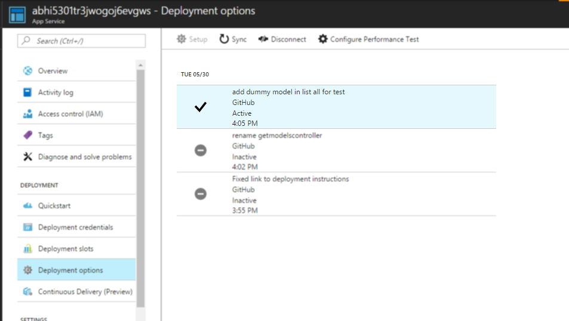

# Product Recommendations Preconfigured Solution Deployment Instructions

This document outlines step-by-step what you need to do to deploy the recommendations preconfigured solution.

>If you don't already have an [Azure account](http://portal.azure.com/), you will need to create one as this solution
>deploys a fully functioning recommendations-service to your subscription.

## Installing the preconfigured solution

1. Go to the [Product Recommendations Template](https://aka.ms/recotemplate) on the Cortana Analytics Gallery.

2. Enter the **Deployment Name**,  select the **Subscription** where you would like to install the solution, the **Location**  (Region) for the deployment.  You may also enter an optional **Description** for your deployment.

3. Click **Create**

## Provide configuration parameters.

You will select a few parameters that will impact the size of the resources that will be created.  

1. The solution will create an Azure Storage account where the models will be stored. The storage
account is also used to store model-metadata and any state required for the solution to work. 
Specify the type of [replication](https://docs.microsoft.com/en-us/azure/storage/storage-redundancy) that you
would like on your storage account.

2. The solution will run as an [Azure WebApp](https://azure.microsoft.com/en-us/services/app-service/web/).
You will need to select the application [hosting plan](https://azure.microsoft.com/en-us/pricing/details/app-service/). 
Note that you can always change the plan from Azure Portal even after you've deployed the service.
>**Important**: The selected plan will determine the size of your machine, and therefore the number of models you can concurrently train and 
> the latency of get-recommendation requests. You can [use these benchmarks](benchmarks.md) to help you choose the right one to start with 
>and later on adjust the plan according to your specific needs and observed latencies 

If you want to increase the size of the scale up or scale out after deployment, you can do that from 
the [Azure Portal](https://docs.microsoft.com/en-us/azure/app-service-web/web-sites-scale).

3. Click **Next**

## Using your newly created solution

Once all the resources have been deployed, you will be provided two keys (*adminKey* and *recommendKey*) 
that can be used to access a newly create RESTful endpoint that you can use to train models, and get product recommendations from
those models.  Take note of those keys, as you will need them later on.

The *adminKey* is the key that can be used for all API operations and gives full error stack on any internal errors, the *recommendKey* can only be used to 
get recommendations, so this is the key you would use on the client or website requesting recommendations.

Those keys can also be found in the  [Azure Portal](http://portal.azure.com/), as **Application Settings** for the newly create AppService.

Congratulations! You now have a recommendations service you can use to train models.
Take a look at the [Getting Started Guide](../getting-started.md) to learn how to create your first model.  If you want to learn abut the APIs exposed you can also take a look at the [API Reference](api-reference.md).

## Post Deployments

To deploy new version of the code on an already deployed solution, there are several possible ways. Two of the many approaches are described below:

#### 1. Ad-hoc deployment using Visual Studio

Manual deployments can be performed from visual studio. More details [here](https://msdn.microsoft.com/en-us/library/dd465337(v=vs.110).aspx).

###### Pre-requisites
1. Visual Studio 15 or greater
2. Local clone / copy of the source code solution - https://github.com/Microsoft/Product-Recommendations/tree/master/source
3. Azure Subscription Access on which solution was originally provisioned.

###### Steps
1. Download the publishing profile from the deployed App Service via Azure portal

2. Open the Recommendations solution - **Recommendations.Core.sln**
3. Right click on the **Recommendations.WebApp** project from the **Solution Explorer** and click **Publish**
4. Import the publishing profile from **step 1**. Refer to [Creating a Publish Profile](https://msdn.microsoft.com/en-us/library/dd465337(v=vs.110).aspx#Anchor_0).
5. Publish the changes. Refer to [Previewing Changes and Publishing the Project](https://msdn.microsoft.com/en-us/library/dd465337(v=vs.110).aspx#Anchor_4).

#### 2. Continous deployment from Azure Portal

An automated pipeline can be setup to code-build-deploy new changes. More details are [here](https://github.com/Microsoft/azure-docs/blob/master/articles/app-service-web/app-service-continuous-deployment.md).

###### Pre-requisites
1. Azure Subscription Access on which solution was originally provisioned.

###### Steps

1. Fork the git hub [project](https://github.com/Microsoft/Product-Recommendations)
2. Open **Deployment options** in the deployed App Service on Azure Portal.
    
3. Choose source as **Github** and select the project Production Recommendations (forked) and hit OK.
4. **Important** - Since the github project contains multiple solutions, we need to set the one we want to use explicitly. This can be done by adding a new setting in **Application Settings** of the App.

    `Key - PROJECT`

    `Value - source/Recommendations.WebApp/Recommendations.WebApp.csproj`
    
    
5. Any changes pushed to the forked branch will be automatically built and deployed.

