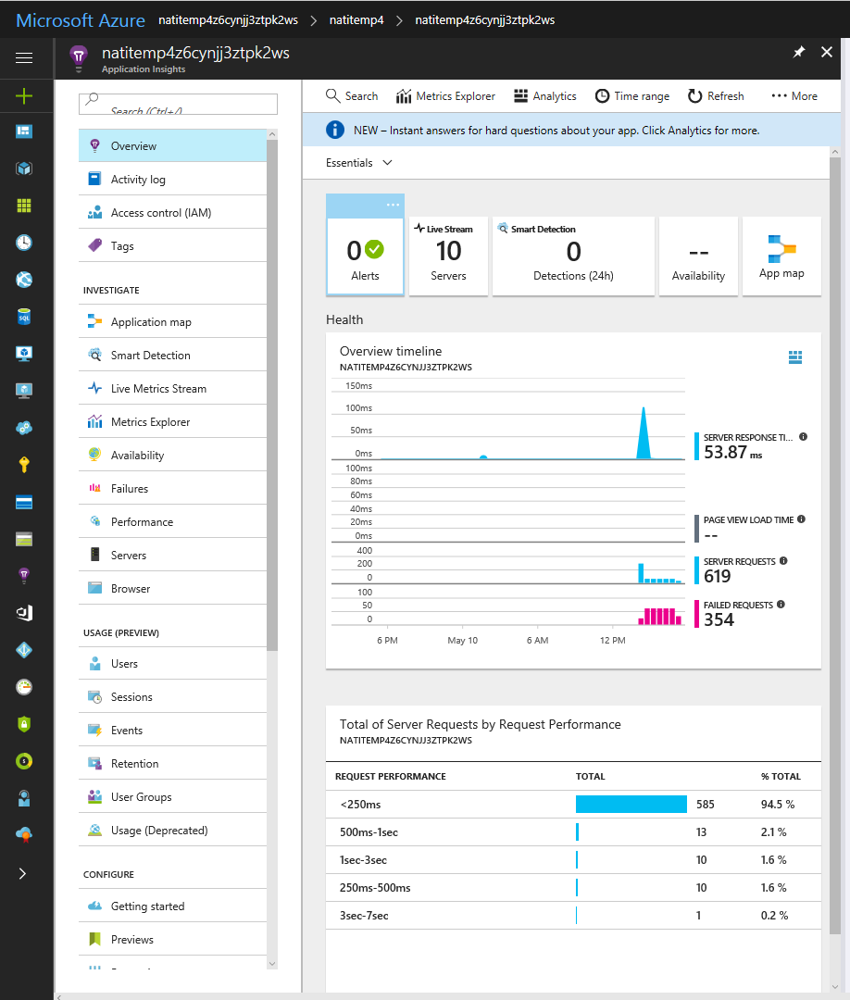
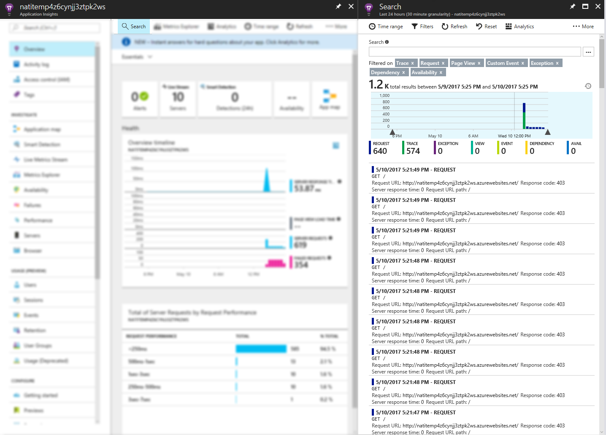
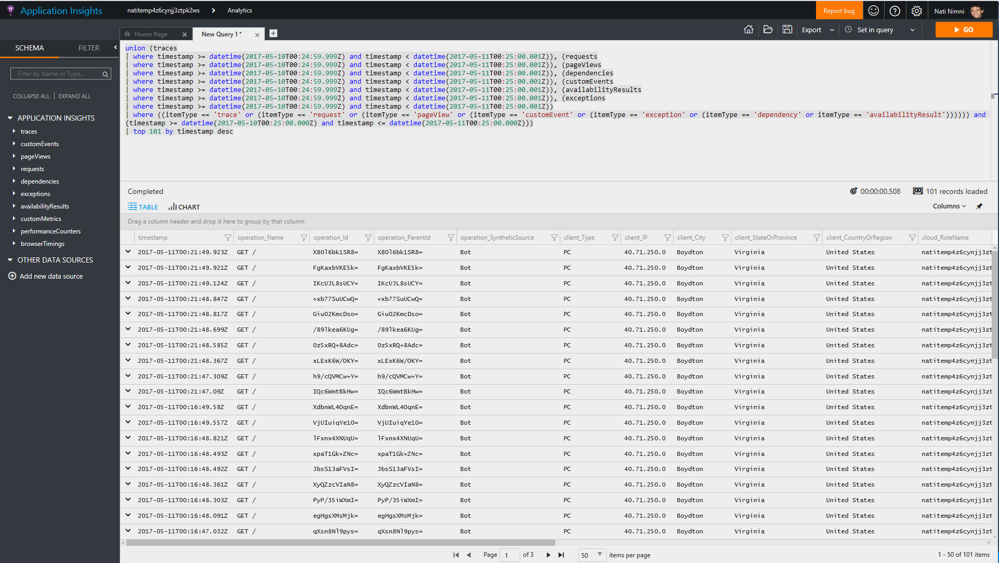

# Troubleshooting and FAQs

## Debugging

The service uses traces to communicate messages with the usual levels (verbose, info, warning, error). These traces are visible in two diffferance channels: [Aplication Insights](#using-application-insights) and [Azure Portal](#using-azure-portal-to-view-trace-messages).

>The logs should give a fair idea of where the system is failing. Below are some [**Common Scenarios**](#common-scenarios) to help get started.

### Using Application Insights
Along side the Recommendation serivce, a new Application Insights app was created. A link to it was displayed on the final deployment page, but can also be found under the same **resource group** as the service it self. 

Browsing to the overview page of your application insights app in Azure portal, you could see the service health metrics (e.g. # of requests, # of failed requests etc.) and the requests latencies:



Clicking on the **Search** tab will expose all the service telemetry, including traces.



#### Using the Analytics Portal to View Trace Messages
Although you can search for traces\events directly from the *search* screen, consider clicking on the **Analytics** button - you'll be redirected to the analytics site where you'll get the full flexible search capability:



> **Tip**: use this query to get all the traces from the passed 1 hour:
> ```` 
> traces | where timestamp >= ago(1h) | sort by timestamp desc
> ````
> Also, if you want to see only warnings and errors, you could further filter as follow:
> ```` 
> traces | where severityLevel > 1 | where timestamp >= ago(1h) | sort by timestamp desc
> ````
>
 
You can learn more about [Application Insights here](https://azure.microsoft.com/en-us/services/application-insights/).

### Using Azure Portal to View Trace Messages
If you disabled Application Insight or prefer not to use it, you can still access the serice traces directly from Azure Portal.
By default, diagnostics are disabled in Azure Web Apps and needs to be enabled by following the steps here - [Enable diagnostics logging for web apps in Azure App Service](https://docs.microsoft.com/en-us/azure/app-service-web/web-sites-enable-diagnostic-log). 

>**Tip:** Stream '*logs and console output*' directly from azure portal. More details are explained here - [Streaming Logs and the Console](https://docs.microsoft.com/en-us/azure/app-service-web/web-sites-streaming-logs-and-console).

---

### Common Scenarios

#### 1. API call fails with 5xx status codes
When using _Admin_ key, a detailed exception message along with inner exceptions are returned to help understand the potential problem. Note that this stack is not returned with the _Recommend_ key.

#### 2. API call fails with 401 Unauthorized
i. Ensure you are passing the api key header - "x-api-key:<*key*>".
ii. For all non recommendation APIs, ensure you are using *AdminKey*.

#### 3. Model training request fails with 400 status codes
In most cases, a clear error message indicating the issue is returned. 


In some cases, error message might not point to exact point of error. This happens mainly if the body is not properly composed. E.g. a boolean parameter has a value other than true/false.


#### 4. API call fails with 415 Unsupported Media type on Post requests
Ensure the header - "Content-Type: application/json" is set.

#### 5. Model takes forever to train. Eventually fails with status "aborted after n attempts"
The recommendations algorithm is a memory based algorithm. Based on the [App Service Plan](https://azure.microsoft.com/en-us/pricing/details/app-service) you choose for the web app, your instance is allocated certain amount of RAM. If you data size is much bigger than the published [benchmarks](benchmarks.md), web-jobs infrastructure gives up on the task after a certain time. This is due to an [open issue](https://github.com/Azure/azure-webjobs-sdk/issues/899) in azure web job infrastructure.

**Recommendation:** Either move to a higher tiered app service plan from your web app in Azure Portal, or to reduce your usage and catalog size.

#### 6. Only one model gets trained at a time. How can I train more models simultaneously?
To ensure performance, only one model training is allowed per App Service instance at a given time. However the number of instances can be increased by scaling up the app service. See [Scale instance count manually or automatically](https://docs.microsoft.com/en-us/azure/monitoring-and-diagnostics/insights-how-to-scale?toc=%2fazure%2fapp-service-web%2ftoc.json)

#### 7. Storage exceptions in logs
As explained in the *High Level Architecture section* of [README](../README.md), the solution uses azure storage queues, tables and blobs for various operations. To handle any networking glitches, the storage SDK client has been configured with retries.
 Blobs and Queues are configured with exponential retry policy while Storage is configured with linear retry policy. More details here - [Azure Storage retry guidelines](https://docs.microsoft.com/en-us/azure/architecture/best-practices/retry-service-specific#azure-storage-retry-guidelines).

| Parameter | Default value | Description |
| - | :-: | - |
| blobClientServerTimeoutMinutes | 20 minutes | Server timeout interval for the request. |
| blobClientExponentialRetryDeltaBackoffSeconds | 4 seconds | Back-off interval between retries.  |
| blobClientExponentialRetryMaxAttempts | 5 | Maximum retry attempts. |
| queueClientExponentialRetryDeltaBackoffSeconds | 4 seconds | Back-off interval between retries. |
| queueClientExponentialRetryMaxAttempts | 5 | Maximum retry attempts. |
| tableClientLinearRetryDeltaBackoffSeconds | 0.5 seconds | Back-off interval between retries.  |
| tableClientLinearRetryMaxAttempts | 5 | Maximum retry attempts. |

If desired, these values can be over-written by adding the above parameter in *Application Settings* of the *App Service.*


#### 8. Scoring latency is degraded
There are two possible scenarios where scoring latency could be degraded.
1. Degradation on first call - When a model is not in cache (see [Architecture](architecture.md)), on a scoring call, it is downloaded from blob storage and loaded in memory. This results in a longer latency (we have seen 0.5-2 seconds), however once this is in the cache, subsequent scoring calls are much faster (<500 msec).
2. Model training is in progress - Since training happens on the same machine, CPU and memory resources are shared. This results in more processing time of a request. Although increasing the number of instannces by Scaling out can help here, requests going to the machine where training is in progress will still be affected.
One idea is to [deploy](deployment-instructions.md) two instances  of the service, reconfigure the second service to have the same  *Application Settings*, specifically the two *Connection Strings* - *AzureWebJobsDashboard* and *AzureWebJobsStorage*. Use first deployment exclusively for training and second exclusively for scoring. This would ensure that training doesn't effect scoring.


#### 9. Cannot open UI when running locally - HTTP Error 500.19 - Internal Server Error
To fix that, edit **RecommendationCore\source\.vs\config\applicationhost.config** file and  
update **system.webServer -> sercurity -> access -> overrideModeDefault** from **Deny** to **Allow**


## Frequently Asked Questions:

#### Q. Where can I see and change my access keys?

There are two kind of keys that are used - *adminKey* - used for all API operations, *recommendKey* - used only to get recommendation. Both the keys have a primay and secondary key which can be viewed/changed via "Application Settings" of the deployed "App Service" on [Azure Portal](http://portal.azure.com). 

#### Q. How can I cancel a model training which is in progress

Same as how you delete a model using the "DELETE" operation. See [Api Reference](api-reference.md)

#### Q. Why can't I select "Free" and "Shared" [App Service Plans](https://azure.microsoft.com/en-us/pricing/details/app-service)?

The solution can **only** be run on 64-bit machines. Since "Free" and "Shared" plans only provide 32-bit machines it is not possible to use those plans.

#### Q. How can I use a custom domain?

See [buy domains](https://docs.microsoft.com/en-us/azure/app-service-web/custom-dns-web-site-buydomains-web-app) and [3rd party domains](https://docs.microsoft.com/en-us/azure/app-service-web/web-sites-custom-domain-name).

#### Q. How can I configure auto-scaling of my web app to handle more load?

Auto scale can be configured from azure portal. This [article](https://blogs.msdn.microsoft.com/devschool/2015/05/24/azure-how-to-auto-scale-your-web-apps-web-sites/) provides a good overview on how to set things up.

#### Q. How can I disable Application Insights?

Application Insights can simply be disabled by removing the key/value - *ApplicationInsightsInstrumentationKey* in "Application Settings" of the deployed "App Service" on [Azure Portal](http://portal.azure.com).

#### Q. How can I deploy a code change?

See [Post Deployments](deployment-instructions.md#post-deployments).

#### Q. How can I access the recommendations UI/Portal?

*endpoint\ui* will open the portal. The *adminKey* will be needed to access it.
